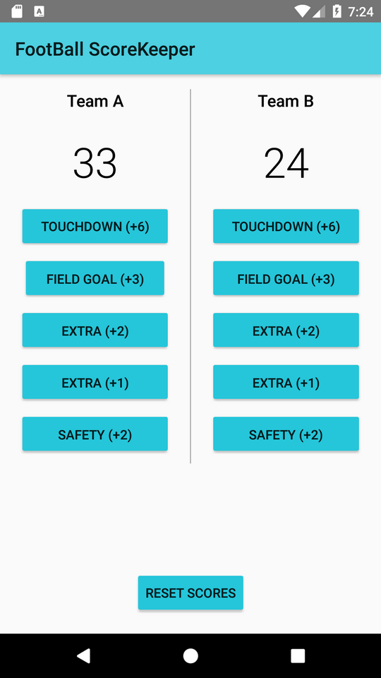

# ScoreKeeper
A Score Keeping Android App Project build in completetion of the Udacity's _Android Basics: User Input_ Course. 
In this Project, I have implemented the American Football Scoring System. I followed the scoring system as stated [here](http://www.topendsports.com/sport/gridiron/basics.htm).

---

## Project Overview

This project is a chance for you to combine and practice everything you learned in this section of the Nanodegree program. You will be making an app that allows a user to keep track of points within a game.

The goal is to create an Score Keeper app which gives a user the ability to keep track of the score of two different teams playing a game of your choice. To build this project, you can follow along with the practice set and customize the Court Counter app to track scores from a different sport.

